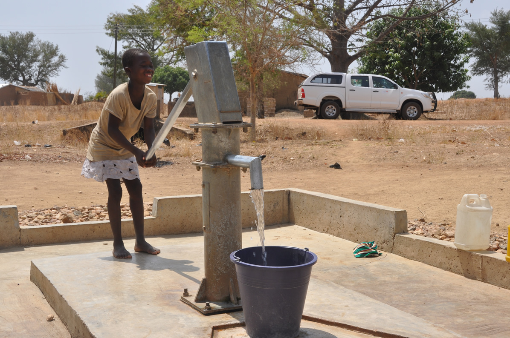

# Uganda Water Accessibility

This brief concept study for using machine learning to assess whether boreholes in Uganda would fail, was presented during for University of Washington's WaterHackWeek in 2019. 

For study see <a src>https://github.com/vega5b/uganda-water-accessibility/blob/master/uganda_boreholes.ipynb</a> in this repo.

### <i>Reference:</i>

Strong, S. (2019). Machine Learning Uganda Borehole Failure, HydroShare, https://doi.org/10.4211/hs.cf0e4c7d6a41457ebcea2ffc397b712d, DOI for this published resource is pending activation.

## Why do boreholes in Uganda (or anywhere) fail?

I imagine a lot of research and thought goes into choosing the water well drill sites, but does well failure correlate with geographic details, population, or political reasons? Is there a trend based on which organization oversaw the installation or raised the capital for the well? Can we create an ML model to determine if correlations exist?
Firstly, what are boreholes?! A borehole is a small narrow shaft drilled vertically or horizontally into the ground to access to the water table below.

* "In rural areas women are usually responsible for collecting water and they benefit by having a borehole as it lightens the burden of carrying water over long distances, saves time and reduces the danger of having to walk alone to fetch water",
* "Households and communities with boreholes are self-reliant, they determine and manage their water usage and they do not have to adhere to municipal water restrictions",
* "Boreholes are beneficial to agricultural projects, farming activities and even construction projects. Water is used for irrigation, maintaining parks and gardens, for crops, livestock and for construction purposes". (http://www.62.co.za/blog/40-benefits-of-water-boreholes)
* Fundamentally, there is no/limited water utility system in rural locations/3rd world countries.
* Boreholes become a viable, albeit unsustainable (?), option

I don't know anything about boreholes (and you may know more). But when I started to fixate on trying to understand what they are, I came across many articles about failed boreholes and whether it is more due to infrastructure, geographic, or people-based problems. It got me wondering.... 

* Can I find historic data about borehole installation and function for an African country? Start small and well documented (even if old)
* What kind of data/info is gathered and can I decipher it? Glossary or terms that could be scientifically interpretable
* Is there enough variables/info to take a stab at understanding maybe what contributes to failure? ML model seems useful since I don't want to force logic or a set of rules about something I don't fully understand
* What would I even do with the results? Find an expert!!
* Can I find enough data to say anything meaningful? Oh man. No clue

Let's play around with some data I found:

* What the data looks like
* What possible trends can we determine (if any)
* What don't we know or what would make this problem better/more constrainable?

